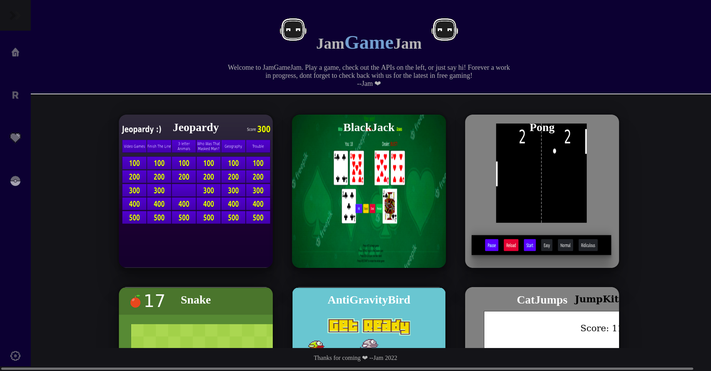

# JamGameJam

JamGameJam my first legitimate brain child. A host for all of my practice game projects, a few fun API's,
  and a rememberence of the free games websites that use to rule the web. Before the micro-transation craze... 
 

# APIs used

<ol>
  <li>RAWG video game database :: <a href="https://rawg.io/apidocs">RAWG</a> </li>
  <li>PokeAPI :: <a href="https://pokeapi.co/docs/v2">PokeAPI</a> </li>
  <li>jService Jeopardy questions :: <a href="http://jservice.io/">jService</a> </li>
  <li>FreeToGame database :: <a href="https://www.freetogame.com/api-doc">FreeToGame</a> </li>

</ol>

